# Poker Coder

Poker Coder is a website designed to teach the basics of the texas holdem poker game, explaining what the game is about, how it is played, and some of the history of this mind sport. With the content of the site in a few minutes, the readers can understand what is necessary to start playing and having fun.

The Poker Coder will be searched by those who don't know how to play poker and would like to get started, it will be very useful for people who do not know the game because it deals directly with all that need to learn.

  - Here is the link to the final project > [Poker Coder](https://guisgrande.github.io/first-project-ci/)

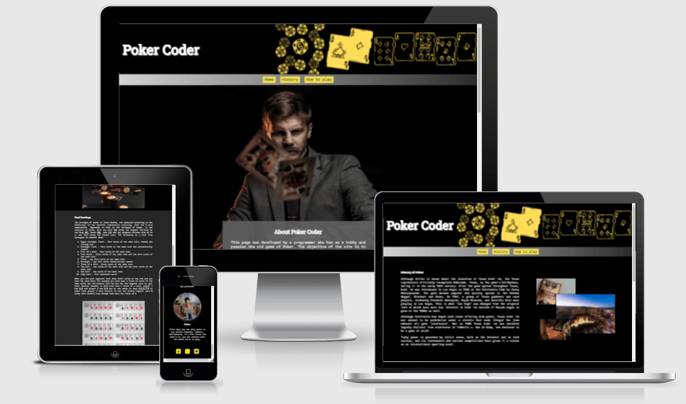

## Contents

    
Summary

- [UX/UI Design](#uxui-design).
     * [Strategy](#strategy).
     * [Scope](#scope).
     * [Structure](#structure).
     * [Skeleton](#skeleton).
       * [Wireframes](#wireframes).
     * [Surface](#surface).
       * [Colour scheme](#colour-scheme).
       * [Typography}(#typography).
       * [Imagery](#imagery).
   
- [Features](#features).
   * [Existing Features](#existing-features).
     * [Home page](#home-page).
     * [History page](#history-page).
     * [How to play page](#how-to-play-page).
   * [Features Left to Implement](#features-left-to-implement).
 
- [Testing](#testing).
   * [Navegation and Devices](#navegation-and-devices).
   * [Validator Testing](#validator-testing).
   * [Performance Testing](#performance-testing).
   * [Other Tests](#other-tests).
   * [Fixed Bugs](#fixed-bugs).
   * [Unfixed Bugs](#unfixed-bugs).
 
- [Deployment](#deployment).
   * [Deployment](#deployment).
   * [Fork](#fork).
   * [Clone](#clone).
  
- [Technologies and tools](#technologies-and-tools).

- [Credits](#credits). 
   * [Content](#content).
   * [Media](#media)
   * [Inspiration](#inspiration).
 
- [Acknowledgements](#acknowledgements).
 

 

## UX/UI Design

### Strategy

#### Site owner goals

- The website was created to teach texas holdem poker to users.
- The website have the objective of explain what the game is about.
- The website will talk about origins and major current events.
- The website goal is to attract people's interest to learn poker.
- The website should be simple to navigate and easy to read.

#### User stories

- As a user, I want to understand the purpose of the website, so I can know if it's of interest to me.
- As a user, I want to easily navigate the site, so I don't lose enthusiasm for using the site.
- As a user, I want to be able to learn something new, so I fulfill the objective that brought me to the site.
- As a user, I want to have access to all the links, so I can connect if it interests me.
- As a user, I want to see media (photos/videos) related to the main subject, so I can better understand what was explained. 

### Scope

- For the Poker Coder website I have planned the following features.
    - Use images, text, and video for more varied content.
    - Use of short texts and longer texts, so the reading doesn't get too tiring.
    - Use technologies and tools that improve site development and performance.

### Structure

- For the Poker Coder website I planned to separate the site into three pages. 
    - The home page, which will be the introduction page of the site, will contain the introduction, questions to arouse interest and talk about the players.
    - The second page will be about the history of poker, with a summary of the origins, the biggest competitions and the last winners of the most important event of the sport.
    - The last page will be about how to play Texas Holdem Poker, with a brief introduction and three more sections: rules, hand rankings, betting, and table positioning.

### Skeleton

#### Wireframes

- The wireframe was created using the Balsamiq tool. The initial idea of comfort image was maintained during the creation of the code, with some adjustments in the layout to visually adapt the page. 
  - The navigation inside the header on the right, I chose to leave it below the title and banner.
  - I decided to put an image on the home page in the about section and not below the questions.
  - I chose not to add images in the tournament section (page 2), to reduce visual information on the page.

Page 01

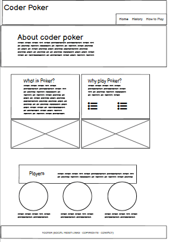

Page 02

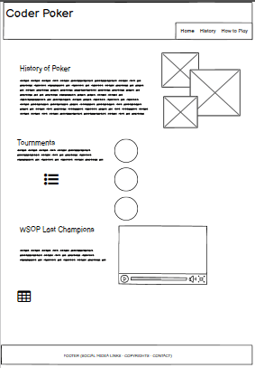

Page 03

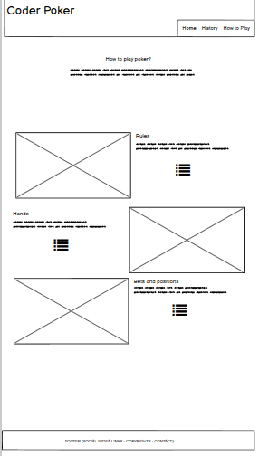

### Surface

#### Colour scheme

- The colors chosen for the composition of the site were a combination of 5 colors (white, black, and 3 shades of gray), white used for all text and details, black for the background, and shades of gray for text boxes and section breaks. 
- To highlight the header and footer I used two shades of yellow. 
- Here is an image of the color palette used on the website (source: Coolors.io).

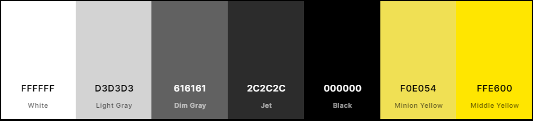

#### Typography

- The fonts were selected from Google Fonts. 
  - For the titles, the font chosen was Robot Slab (Regular 400).
  - For the body of the website the font chosen was Roboto Mono (Light 300).
  - The font selected as the second option in case of any loading problems was san-serif.

#### Imagery

- The images selected for the website are intended to complement and assist the content. Each image selected was designed to match the section it was added to.
  - About section image: to create an initial visual impact.
  - Players section images: to portray the mentioned themes.
  - History section images: three different photos to create an overlapping effect. Due to copyrights on old tournament photos and the difficulty in finding good ones, I opted to use photos available on free photo sites.
  - WSOP Last Champions section: video selected to show what a poker tournament looks like.
  - How to play page: the first image shows someone about to make a move and the next two images visually portray what was explained in the texts.

## Features

### Existing Features

- __Banner__
  - Present on all pages (Home/History/How to play) is intended to create a style and identity for the page. The elements in the image refer to the title and theme of the site.

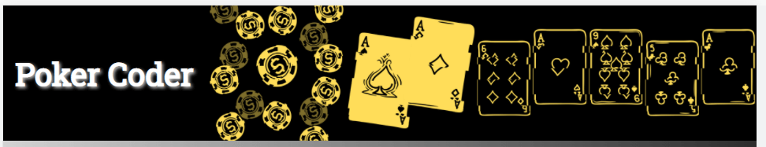

- __Navigation Bar__
  - Present on all pages to facilitate navigation between them. The font is the same used throughout the website, I tried to keep the style and colors the same as the banner. 
  - I added a hover effect on the navigation options to make them stand out more when selecting them.

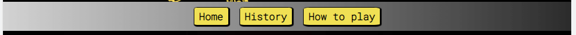

- __Footer__
  - Present on all pages as well, has icons to direct users to social network pages. The links open on a new page. It is intended to create a connection with the users.
  - I added a hover effect on the social media icons to make them stand out more when selecting them.

#### Home page

- __About Section__
  - This section was created with the intention of introducing the user to the website and explaining what information he/she will have access to. 

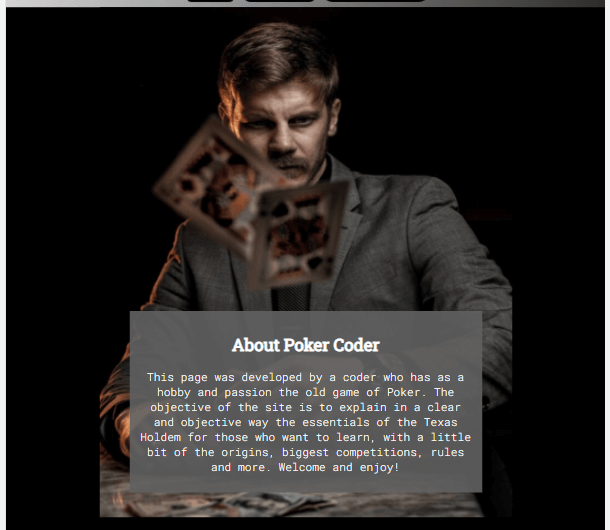

- __Questions Section__
  - This section has two important questions that can draw the user's attention. What is poker explains the game in a short way and why shows some advantages and benefits that can be gained by playing.

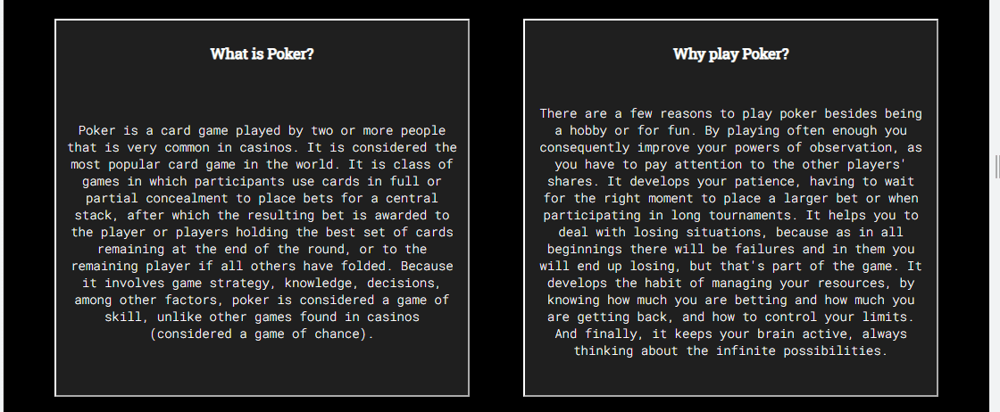

- __Players Section__
  - The last section of the home page is intended to show users that there are no barriers to start playing. And that you can include anyone in the game.
  - The images try to portray the situations mentioned. I added a shadow effect to make the photos stand out.

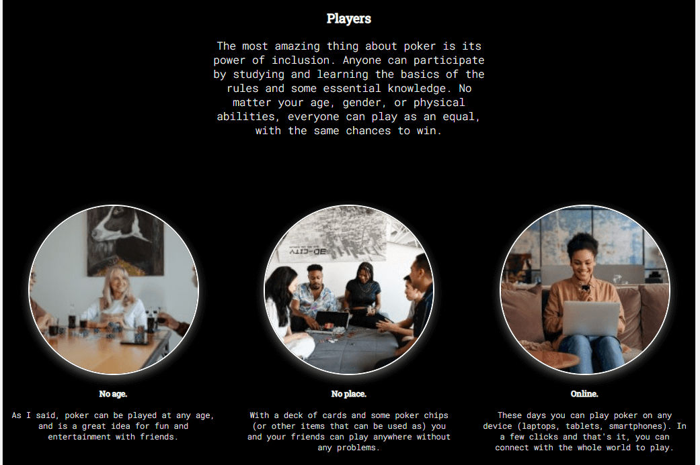

#### History page

- __History Section__
  - The history section is intended to give you some facts and a brief idea of how poker started.
  - It displays some overlapping photos to add a visual element. For copyright reasons, I preferred to use free photos instead of historical ones.

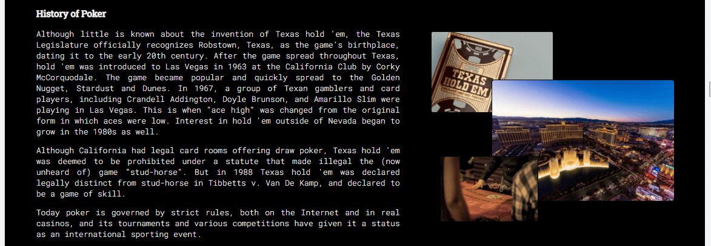

- __Tournment Section__
  - The tournament section is intended to show the user some of the biggest poker leagues in the world. To get a sense of the size and organization of the card game. 
 

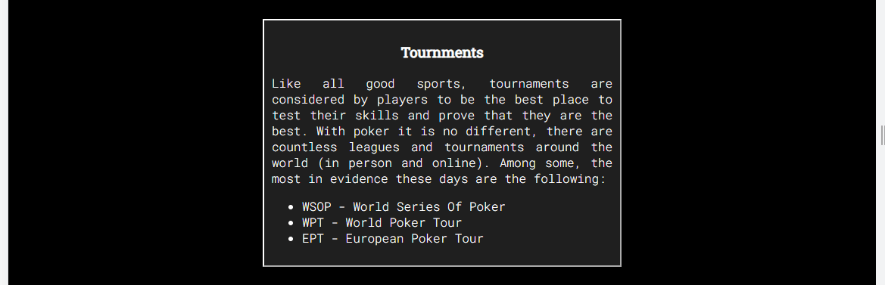

- __WSOP Last Champions Section__
  - The last section of this page presents information about the latest winners of poker's biggest event. To gauge how crowded these tournaments are.
  - The video is intended to show how a tournament is, the structure, and also the dynamics of the game.

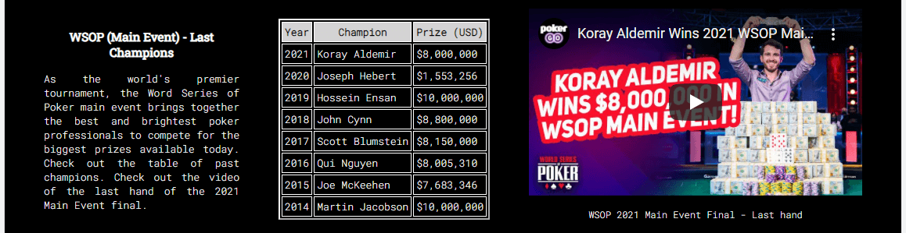

#### How to play page

- __How to play Section__
  - The first section is a brief introduction to the basics of how to play. It shows the user what he needs to learn the game.

- __Rules Section__
  - The rules section informs the user of the main rules necessary to understand the game. With this information, the user will already understand poker.

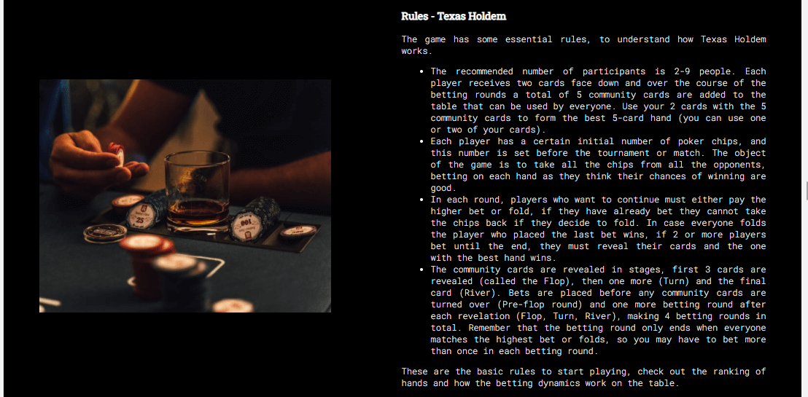

- __Ranking Hands Section__
  - In this section as a continuation of the essentials for playing, shows the card combinations and what their value is within the game. It shows the user the possibilities in an orderly manner to facilitate understanding.
  - The image used in this section is intended to represent the information in a visual way. 

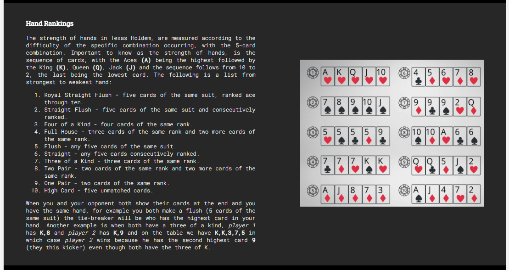

- __Bets and Positions Section__
  - The last section of the page, aims to show the user how the moves and bets behave and what the game sequence is. This increases the user's understanding of the dynamics.
  - The image used also has the intention of visually instructing the progress of the bets and moves on a poker table.
 

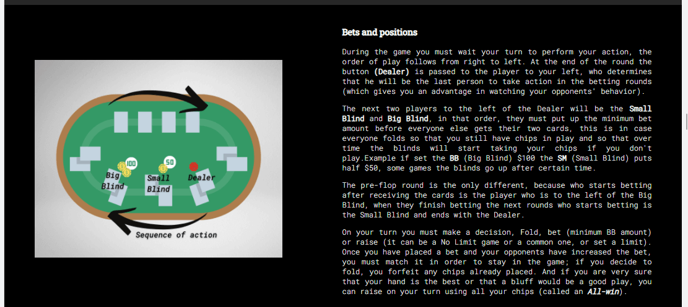

  - By the end of reading all this information the user will be ready to start playing Texas Holdem Poker.

### Features Left to Implement

  - For the future, leave open the possibility of adding a page to simulate the game, giving the user a way to test the acquired knowledge and see how the game is played in practice.

## Testing

- I ran the tests on multiple devices and different browsers, in order to cover the widest possible range of screen sizes and models. 

### Navegation and Devices

- __Browsers__
  - Chrome
  - Firefox
  - Safari
  - Edge

- __Devices__
  - Apple: Iphone SE, Iphone 13 Pro Max, Iphone 8, Iphone XR, Iphone 12 Pro, Ipad Air, Ipad Mini.
  - Samsung: Galaxy S8+, Galaxy S20 Ultra, Galaxy A51/71, Galaxy Tab S4, Galaxy Note II.
  - Motorola: Moto G4.
  - LG: Optimus L70, Nexus 4, Nexus 10.
  - Google: Pixel 5, Pixel 3 XL.

### Validator Testing 

- __HTML__
    - No errors were returned when passing through the official W3C Validator. [Validated](https://validator.w3.org/nu/?doc=https%3A%2F%2Fguisgrande.github.io%2Ffirst-project-ci%2F)

    
All html pages validated

 
1. Home page - [index.html](https://validator.w3.org/nu/?doc=https%3A%2F%2Fguisgrande.github.io%2Ffirst-project-ci%2Findex.html).
2. History page - [history.html](https://validator.w3.org/nu/?doc=https%3A%2F%2Fguisgrande.github.io%2Ffirst-project-ci%2Fhistory.html).
3. How to play page - [how-to-play.html](https://validator.w3.org/nu/?doc=https%3A%2F%2Fguisgrande.github.io%2Ffirst-project-ci%2Fhow-to-play.html).
 

 

- __CSS__
    - No errors were found when passing through the official W3C Jigsaw Validator. [Validated](https://jigsaw.w3.org/css-validator/validator?uri=https%3A%2F%2Fguisgrande.github.io%2Ffirst-project-ci&profile=css3svg&usermedium=all&warning=1&vextwarning=&lang=en)

### Performance Testing

- __Lighthouse DevTools__
   - I used a Lighthouse tool to check performance, accessibility, best practices, and SEO on each of the pages.

1. Home Page

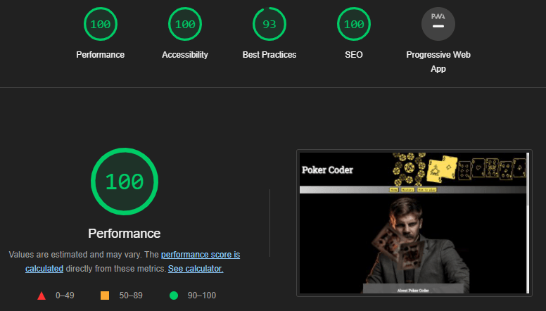

2. History Page

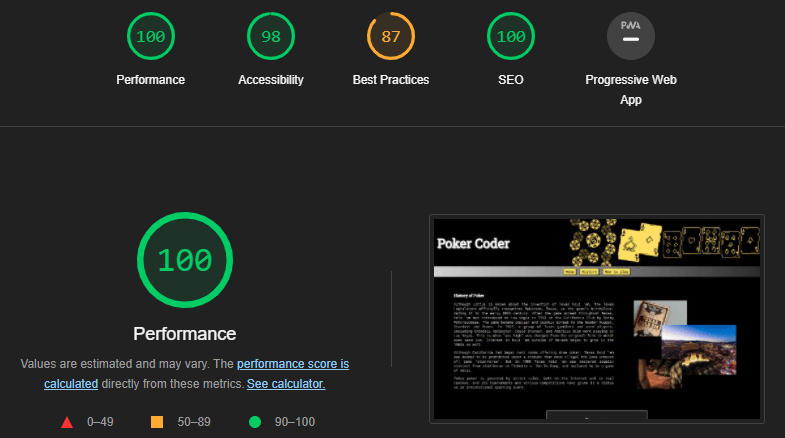

3. How to play Page

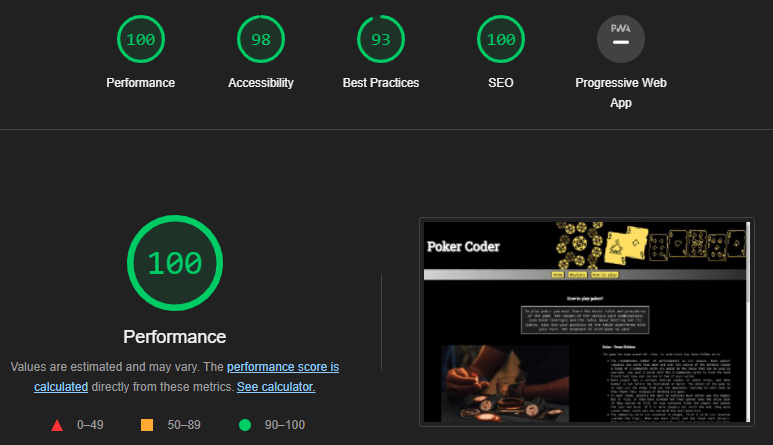

### Other Tests

- __Acessibility__
    - To check accessibility, I did the test using WAVE from WebAIM. The site didn't present any errors or alerts. [Report](https://wave.webaim.org/report#/https://guisgrande.github.io/first-project-ci/)

- __Site goals__
    - After finishing the website, I went back to check if the goals had been achieved. I sent the website to about 12 people (friends and family) all considering that the objectives were met.
     - Once tested, the website can teach texas Holdem to users.
     - Once tested, the website can explain what the game is about.
     - Once tested, the website can talk about origins and major current events.
     - Once tested, the website has the potential to attract users' attention to learning poker.
     - Once tested, the website is simple to navigate and easy to read.

### Fixed Bugs

- The first bug fixed was in the header, where it was not fixing 100% of the width of the page on certain screen sizes, showing a gap between the header and the end of the page. To fix the bug I changed the code for the header CSS style.
   - Changes to fix bugs can be seen here. [Commit](https://github.com/guisgrande/first-project-ci/commit/a2e12e6f4a434de09851ef5cb798bcbe47230186).

- Another bug I fixed was on the home page, where the text was not aligned with the image when doing responsive testing. I was able to fix the problem by changing the positioning code of the image and the text.
   - Changes to fix bugs can be seen here. [Commit](https://github.com/guisgrande/first-project-ci/commit/66a5a0938ac8da5e3d7abd27b09444c6b02eab0a).

### Unfixed Bugs

- I have not identified any bugs to be fixed when finalizing the project. 
  - The only observation is to try to improve the quality of the photos used in the players section of the home page.

## Deployment

- To create this project I used GitHub and GitPod.
- I used the [Code Institute Gitpod Full Template](https://github.com/Code-Institute-Org/gitpod-full-template), clicking on the "Use this template" button. From there I created the repository on Github with my username.
- These commands were used for version control during project:
    * git status - to check the status of the files to be commited.
    * git add filename - to add files before committing
    * git commit -m "message" - to commit changes to the local repository
    * git push - to push all committed changes to the GitHub repository

### Deployment

- To deploy the site to Github pages follow this steps:
1. In the GitHub repository, select the Settings options.
2. Scroll down until you find "GitHub Pages" section.
3. Select the option "Check it out here", will gona send you to the next page.
4. Choose "Main" for the branch in the drop down box.
5. Choose "Root" for the directory in the next drop down box.
6. Then click "Save".

### Fork

- Forks let you make changes to a project without affecting the original repository. Follow this steps:
1. Go to the repository page, can be accessed [here](https://github.com/guisgrande/first-project-ci).
2. On top right, you select the Fork option and proceed.
3. A duplicate will be created inside your repository.

### Clone

- Clone let you create an identical repository to the original. Follow this steps:
1. Go to the repository page, can be accessed [here](https://github.com/guisgrande/first-project-ci).
2. Click on code drop down menu.
3. Choose if you want to clone using HTTPS, SSH or GitHub CLI. Then select de copy button.
4. Open your Git Bash in your IDE.
5. Type git clone and then paste the URL you copied before.
6. Press Enter to create your clone.

## Technologies and tools

- DevTools - to assist in the development of the project.
- Gitpod - to create/edit the code of the project.
- Github - to create repository, hosting files and deployment of the website.
- Lighthouse (Chrome Devtools) - Used to performance test.
- [WAVE](https://wave.webaim.org/) - Used to acecessibility test.
- [Font Awesome](https://fontawesome.com/) - Used for the icons used in the footer.
- [Favicon.io](https://favicon.io/) - Used to implement the favicon on the website.
- [Canva](https://www.canva.com/) - Used to create the Favicon, Banner, Hands Rankings and Bets and Positions images. 
- [Coolors](https://coolors.co/) - Used to choice of colors and for the palette used in the README.
- [Google Fonts](https://fonts.google.com/) - Used for font selection.
- [Balsamiq](https://balsamiq.com/) - Used to creat the wireframes.
- [TinyPNG](https://tinypng.com/) - Used to reduce the size of images and photos.

## Credits

### Content

- The text for the History page was taken from Wikipedia. [Texas Hold'em Article](https://en.wikipedia.org/wiki/Texas_hold_%27em_).
- The video used for History page was taken from Youtube. [Youtube - official link](https://www.youtube.com/watch?v=ovKBlXdQji4).
- The informations used in WSOP Last Champions table for History page was taken from [WSOP Website](https://www.wsop.com/).

### Media

- The photos used for Home page and the another one used at How to Play page was taken from [Pexels](https://www.pexels.com/).
- The photos used for History page was taken from [Unsplash](https://unsplash.com/).
- The image used for README.md responsive mockup was taken from [Am I Responsive](http://ami.responsivedesign.is/).

### Inspiration

- Shadow and Gradients effects had as a query the following page for its implementation on the website. [W3Schools](https://www.w3schools.com).

## Acknowledgements

- Code Institute for all the support and the team always ready to help.
- My mentor [Ben Kavanagh](https://github.com/BAK2K3) for all the instructions, advice and knowledge that helped me to improve the project.
- My parents, my wife and my friends for motivating me to achieve my best.
- Everyone in the Slack community for tips and opinions. 

